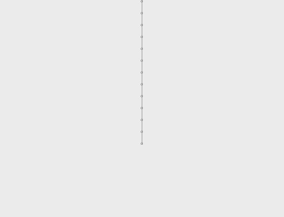

# Forløb 12
## Opgave : Tegning af træ med funktioner
### Emner : funktioner og rekursion

Nedenstående kode tegner en lille streg, med en circkel i begyndelsespunktet.  
Det er meningen at koden, der tegner den lille streg skal anvende til at tegne et helt træ!

```java
void setup(){

  size(500,500);

  //Kode der tegner en illustration af en gren
  float v =PI/4;
  float l =20;
  float x1=50;
  float y1=50;
  float x2=cos(v)*l+x1;
  float y2=sin(v)*l+y1;
  ellipse(x1,y1,3,3);
  line(x1,y1,x2,y2);

}
```
### Opgave
1. Gennemgå koden og forstå hvordan den virker, hvad gør de forskellige variabler?

2. Flyt koden for "grenen" ud i en funktion, med input parametre til start-punkt, længde og vinkel...     
Afprøv metoden - virker den?
```java
//sådan skal funktions signaturen se ud
void gren(float l, float v, float x1, float y1){
  //funktions-kode
}
```

3. Kan du få funktionen "gren" til at kalde sig selv - så den efter hver tegnet gren tegner en ny gren i forlængelse...

2. Skriv kode så "grenen" tegner en ny gren i enden af hver tegnet gren, 10 gange! (dvs.funktionen skal kalde sig selv)
3. Se om du kan få "grenen" til at tegne to nye grene i enden af hver gren, 1
4. Se om du du kan nøjes med at tegne en gren hvert frame
