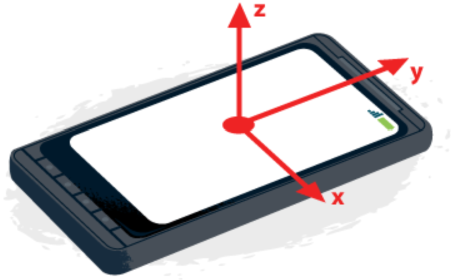

# Forlob 12 - js - opgaven
## Lav et website, der anvender din mobiltelefons accelerometer-data

I dette forløb skal i lave et website, der anvender din telefons accelerometer-data.
I kan vælge to forskellige opgave typer:

### Opgaver
Vælg en af disse opgaver. Husk jeres endelige ide skal godkendes, så det ikke bliver for nemt!
1. Lav et website med et vippeplade-spil, eller lignende vha. p5js
2. Lav et website almindelig flot visning af accelerometer-data vha. ren html, css og js

### Værktøjer
For at få afprøvet et website, der tilgår accelerometerdata på jeres telefon, er det nødvendigt at jeres websitet ligger offentligt tilgængeligt via https. 
1. [https://editor.p5js.org/](https://editor.p5js.org/) : Organisationen bag processing har både lavet p5 biblioteket, der en js version af processing og denne virkelig brugbare online editor. Hvis i logger ind er det muligt at gemme projekter, og dele dem via et link, der anvender https.
2. [https://stackblitz.com/](https://stackblitz.com/) : Dette er en af mange online editorer, hvor man kan lave et website baseret på direkte html, css og js.

### DeviceMotionEvent eksempel
Her vises koden, der skal skives i p5js. Det er akkurat den samme kode, der skal anvendes på et website som ikke bruger p5js:

- [Koden](https://editor.p5js.org/ajrp2008/sketches/kG8I24Qe0)
- [Afprøv](https://editor.p5js.org/ajrp2008/full/kG8I24Qe0)

Vigtigt : I skal flytte koden over til jeres egen konto for at bruge den ;-)

### Materiale:
- [p5js](https://p5js.org/)
- [DeviceMotionEvent](https://developer.mozilla.org/en-US/docs/Web/API/DeviceMotionEvent)

