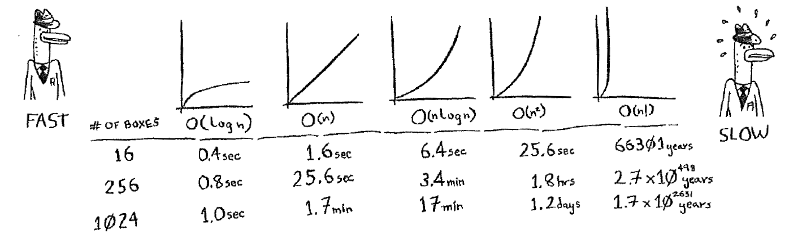
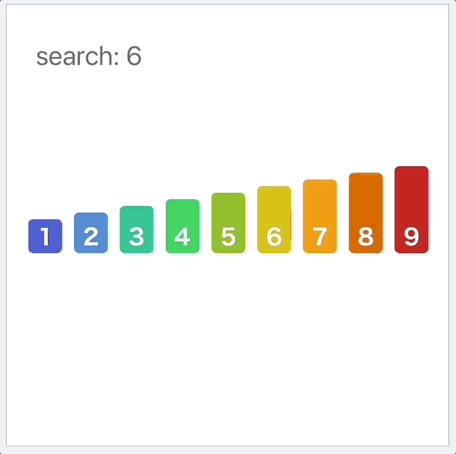

# Forløb 13 
## Introduktion til algoritmer og kørselstiden

#### Om algoritmer
Algoritmemønstre: definerede procedurer til at løse et problem.
- At skulle finde et specifikt element i en samling af elementer
- At se om der forbindelse imellem to punkter og finde den korteste eller billigste sti
- At skulle sortere noget
- At skulle finde det mest optimale træk
- At skulle kryptere noget
- At skulle tjekke om noget kolliderer
Et algoritmemønster udtrykker en gentagelig, trin‐for‐trin løsning på tværs af
programmeringssprog – dvs. uafhængigt af den konkrete implementering i fx Java, C#, Python eller Javascript.

#### Om kørselstiden
En algoritme vokser på en specifik måde i forhold til forbrug af tid og rum/memory - ud fra antallet af input/muligheder/elementer.     
Man vil ofte gerne kunne definere en øvre grænse for en algoritmes forbrug – hvor slemt kan det blive, hvis man benytter denne algoritme?    
Vi skal prøve at bygge et lille website, der beregner kørselstider for forskellige algoritmer: 

----------------------------------------------------------------------------------------------------------------------------------------------------------------------

## Dagens opgave - målinger af kørselstid,- og tilnærmede funktioner 

Hele dagens arbejde laves, gemmes og uploades til lectio-afleveringen "Algoritme-intro".
I skal aflevere minimum opgave A,B og C.
Glædelig jul og god fornøjelse ;-)

----------------------------------------------------------------------------------------------------------------------------------------------------------------------

#### Opgave A : Koden, og vurdering af kørselstid

[Anvende dette website som udgangspunkt : maaling.html](maaling.html)

A1. Hvilken kørselsfunktion er tættest på den du ser i målt på - maaling.html ?

A2. Kig på source-koden og vurder hvorfor kørselsfunktionen ser ud som den gør ?

----------------------------------------------------------------------------------------------------------------------------------------------------------------------

#### Opgave B : Sorterings-algoritme kørselstid

B3. Implementer sorterings-metoden bubble-sort eller en anden sorteringsalgoritme (brug gerne en kopi af maaling.html).   
Vælg meningsfulde input-arrays. Se animationen nedenfor: 

B4. Hvilken kørselsfunktion ligger tættest på de data i ser ?

B5. Kig på koden og vurder hvorfor kørselsfunktionen ser ud som den gør ?

----------------------------------------------------------------------------------------------------------------------------------------------------------------------

#### Opgave C : Binær søgning (i meget store arrays)

Vigtigt :   
Forudsætningen for at søge efter et bestemt tal i et array med binær eller lineær søgning er at arrayet er sorteret.   
Men man kender ikke nogen af de værdier arrayet indeholder!

C6. Forklar hvordan binær-søgning virker ved at kigge på animationen, imodsætning til lineær-søgning. 
(søg eventuelt på nettet)

C7. Implementer input data, der består af tilfældige sorterede tal i tiltrækkelig store mængder 

C8. Hvilken kørselsfunktion ligger tættest på de data ser målt ?

C9. Kig på koden og vurder hvorfor kørselsfunktionen ser ud som den gør ?

----------------------------------------------------------------------------------------------------------------------------------------------------------------------

#### Opgave D : Udtænk og byg en hurtig måde at indsætte og finde tal i et meget stort array

D10. Og implementer denne metode

----------------------------------------------------------------------------------------------------------------------------------------------------------------------
