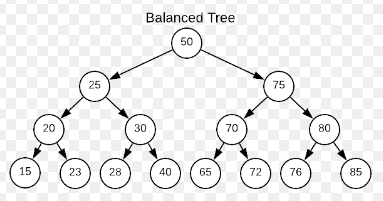

# Forløb 13 Algoritmer
## Del 3 - opsamling 

---------------------------------

## A : Bevis for at "order of growth" for søgetiden i det perfekt balancerede binære træ, i værste tilfælde er : log2(N)

Som det ses bliver hvert "niveau" i træet dobbelt så stort som det forrige.  
Det første niveau indeholder en node dvs. 2^0 = 1.   
Det næste niveau 2^1 = 2.   
Det næste niveau 2^2 = 4.
Osv.

Dette kan omskrives til følgende, hvor N er antal noder i træet, hvor k er højden på træet:
2^0 + 2^1 + 2^2 + 2^3 + 2^4 + 2^5 + ... + 2^k = N

De første to led giver:  2^0 + 2^1 = 2^2 - 1
Plus det tredje led: 2^2 + 2^2 - 1 = 2^3 - 1
Plus det fjerde led: 2^3 + 2^3 - 1 = 2^4 - 1
Til sidst:           2^k + 2^k - 1 = 2^(k+1) - 1

N = 2^(k+1) -1 <=> log2(N-1) = (k+1)*log2(2) <=> log2(N-1)-1 = k

Da søgeningen i værste tilfælde svarer til at noden befinder sig i bunden af træet er dette "worst-case søgetiden"... 

---------------------------------

## B : Repetitions opgaver

Prøv nu at svare på følgende opgaver, der nogenlunde dækker hvad vi har beskøftiget os med i dette forløb:

- hvad er en algoritme?
- hvad er en datastruktur?
- hvilke algoritmer og datastrukturer forekommer i forbindelse med implementationen af et funktionelt binært-søgetræ?
- hvad menes der med begrebet "kørselstid"?
- hvordan bestemmer man kørselstiden praktisk?
- hvordan bestemmer man kørselstiden teoretisk?
- hvad menes med "order of growth" (se eventuel her [https://algs4.cs.princeton.edu/14analysis/](https://algs4.cs.princeton.edu/14analysis/))?
- hvad forståes ved begreberne "worst case", "average" og "best case"?

--------------------------------

## C : Vurder hastighederne på følgende 2d-collision-detection algoritmer (implementer dem eventuelt)

### opgave 1 : brute-force
For hvert enkelt objekt skal afstande måles til alle andre objekter, hvis en afstand er mindre end kollisions-afstanden er der en kollision 

### opgave 2 : "smart" brute-force
For hvert enkelt objekt skal afstande måles til alle andre objekter, hvis en afstand er mindre end kollisions-afstanden er der en kollision
Hver gang et objektet A,  er undersøgt om det kolliderer med alle andre "mulige" objekter, indgår objektet A ikke længere i algoritmen...

### opgave 3 : sweep and prune
Sorter alle objekt efter deres X-position
For hvert enkelt "objekt" skal afstande måles til alle andre objekter, hvis en afstand er mindre end kollisions-afstanden er der en kollision
Hver gang et objektet A,  er undersøgt om det kolliderer med alle andre "mulige" objekter, indgår objektet A ikke længere i algoritmen...

--------------------------------

