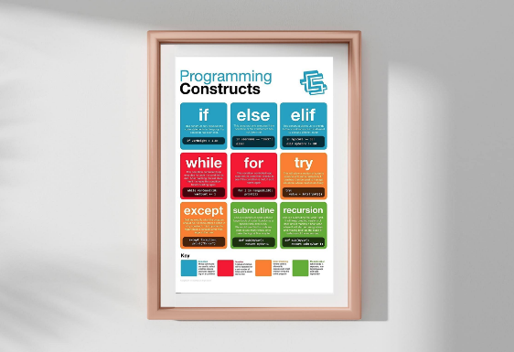
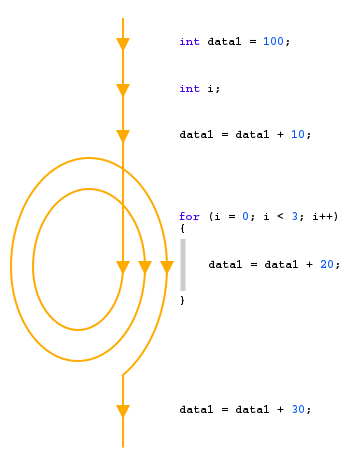

### Forløb 1: Rep. af sidste år og udarbejdelse af plancher/plakater

**varighed:** 

d.11/8 fredag, mandag d.14/8 og d.18/8 fredag, ialt 5 moduler

**indhold:**  

Fælles gennemgang af emner og formål med forløbet. Vi skal udarbejde nogle plancher/plakater, der skal opsummere al vores samlede viden (dvs. undervisningsindholdet fra sidste år) i nogle let overskuelige plancher, der kan kigges på, hvis man er tvivl om hvordan man laver "loops" og hvad formålet er med dem. Plancherne skal udarbejdes med overskuelighed for øje og skal hænges op fysisk i lokale 1.62 (som vi har flest timer i). Desuden skal de også gemmes digitalt her på vores website.
Når plancherne/plakaterne er færdige præsenterer vi grupperne hver deres plakat for klassen     
Efterfølgende tager vi en test og ser om vores nye plakater/plancher gør en forskel på karaktergennemsnittet :-)

**plancher/plakater:** 

Gør jeres bedste for at lave et flot produkt (i kan jo også gøre brug af jeres kom-it færdigheder), vi skal jo forhåbentlig kunne kigge på de her placher resten af året!
Hvert emne forventes belyst med kreative og meningsfulde tegninger og eksempler. Desuden skal alle tænkelige fagtermer indgå tydeligt  

Her et eksempel på et "for-loop eksempel":

Plakaterne skal indeholde:
- tydelige og meningsfulde tegninger
- gode eksempler
- alle fagtermer

**emner:**

Det vil sandsynligvis forekomme overlap på plakaterne. Det gør ikke noget. 
- 1: variabler og datatyper
- 2: forskellen på referencebaserede typer og værdibaserede typer
- 3: for og while loops
- 4: if statements og betingelser
- 5: arrays og arraylister
- 6: opreratorer både logiske og aritmetiske
- 7: funktioner og metoder
- 8: klasser og objekter
- 9: reference polymorfi med polymorifi med overloading
- 10: komposition, nedarvning og override

**grupper:**

 - Gruppe 1 - Tobias Qvistgaard, August Eklund, Anas Al-Atrash
 - Gruppe 2 - William Fogh, Simon Toftemark, Thomas Carstensen
 - Gruppe 3 - Max Rasmussen, Peter Hæstrup, Mei Skaaning
 - Gruppe 4 - Ruben Egelund, Oskar Schweitz, Marius Andersen
 - Gruppe 5 - Jonathan Borgholm, Marinus Christensen, Sofie Lybech
 - Gruppe 6 - Simone Boesen, Boaz Jager, Oliver Wahl
 - Gruppe 7 - Lucas Jensen, Rebecca Bigum, William Lerche
 - Gruppe 8 - Ersan Ökmen, Oscar Thoft-Christensen, Anas Al-Hummadi
 - Gruppe 9 - Thor Kaas, Magnus Forsberg, Magnus Byrne
 - Gruppe 10 - Emil Gotlieb, Patrick Duus

**forløbsplan:**

- fredag d.11/8: introduktion / og arbejd i grupper
- mandag d.14/8: arbejde i grupper / præsentation for undertegnede (jeres lærer)
- fredag d.18/8: præsentation for de andre i klassen
- næste gang: test!!
