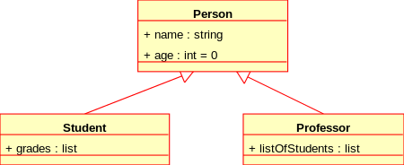
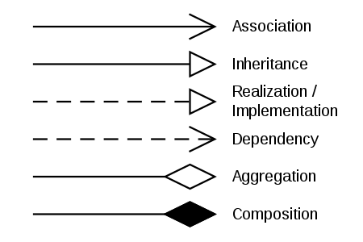

# Forløb 22 - Opgave i klassediagrammer

 Nye termer : composition og aggregation (dk: noget i retning af "komposition" og "samling")    
 Ny datatype : ArrayList    

-------------------------------------

## Klassediagrammer - notation

Når man dokumenterer et objektorienteret program anvender man klassediagrammer.   
I programmering skal vi sum minimum kunne tegne følgende dele af klasse-diagrammet:
- klassen
- nedarving
- komposition eller aggregation

--------------------------------------------------------------------------------------
### Klassen
Klassen tegnes således:  
    

Koden kunne se således ud:        
```java
class BankAccount{
  String owner;
  Dollars balance = 0;

  void deposit(Dollars amount){/*kode*/}

  void withdrawal(Dollars amount){/*kode*/}
}
```

--------------------------------------------------------------------------------------
### Nedarvning
Nedarvning tegnes således:    
       

Koden for diagrammet kunne se således ud:
```java
class Person{
  String name;
  int age;
}

class Student extends Person{
  List grades;
}

class Professor extends Person{
  List listOfstudents;
}
```
--------------------------------------------------------------------------------------
### Komposition og aggregation
Komposition og aggregation tegnes således i klassediagrammet.    
Oftest vil vi bare bruger begrebet "komposition" og se lidt stort på om det er det ene eller det andet...:      
    

Koden for Car og Carburetor kunne se således ud:
```java
class Carburetor{
  //kode//
}

class Car{
  Carburetor carburetor = new Carburetor;
}
```
--------------------------------------------------------------------------------------
Klassediagrammer kan dog være meget komplicerede og indeholde mange forskellige relationer. Her ses en oversigt over de almindeligste "klassediagrams pile":     
   

--------------------------------------------------------------------------------------
Jeg har taget diagrammerne fra wikipedia, se her  for mere info: [https://en.wikipedia.org/wiki/Class_diagram](https://en.wikipedia.org/wiki/Class_diagram)
--------------------------------------------------------------------------------------
