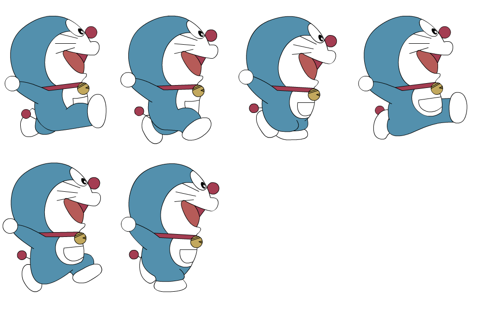

# Trin 4: ANIMATION

## Nye krav til programmet:

Jeres program skal nu udbygges med en animation, af minimum en karakter, f.eks. spilleren.    

I skal anvende spritesheet.    

Enten laver i det selv grafik eller også downloader i det fra nettet.


## Forslag til implementation af animation:   

Her ser i mt spritesheet:


Selve koden skal nu hente hert enkelt billede, fra vores spritesheet og vise dem den rigtige rækkefølge som en tegnefilm.   
I min kode kalder jeg det enkelte billede, en 'frame'.   

Her er min kode:
```java
PImage spritesheet;

int wFrame;            //bredde på hver enkelt frame i spritesheet  
int hFrame;            //højde på hver enkelt frame i spritesheet  
int row, column;       //row og column bruges til at vælge hvilken "nummer" frame
int x=0,y=0;           //x og y anvendes til at finde øverste venstre hjørne af denne frame 

int reverseFactor = 1; //reverseFactor bruges til at spejlvende en frame

void setup() {
 // frameRate(10);
  size(300, 300);
  imageMode(CENTER);
  spritesheet = loadImage("sprite.png");
  wFrame = spritesheet.width/4;
  hFrame = spritesheet.height/2;
}

void draw() {
  clear();
 
  if(frameCount%5==0){ //animationen er lidt hurtig, så jeg ændrer kun frame hver 5. billede
  
    //udvælgelse af næste frame
    if (column<3){ column++; } else { column=0; row++; }    
    if (row==2)  { row=0;    }
    if (row==1 && column==2) { row=0; column=0; }
    x = (column)*wFrame-25;
    y = (row)*hFrame;
    
  }
  
  PImage sprite = spritesheet.get(x, y, wFrame, hFrame);

  pushMatrix();
  scale(reverseFactor, 1);
  //billedet var alt for stort så det er sat til 100X100 pixels istedet
  image(sprite, reverseFactor*mouseX, mouseY,100,100);    
  popMatrix();
}

void mousePressed(){
  //hvis man trykker på keyPressed spejlvendes billedet
  reverseFactor*=-1;
}
```


## Se følgende video, der viser hvordan mit program virker:

<iframe width="560" height="315" src="https://www.youtube.com/embed/pE8wsABvaIA" title="testAnimation" frameborder="0" allow="accelerometer; autoplay; clipboard-write; encrypted-media; gyroscope; picture-in-picture; web-share" allowfullscreen></iframe>


## Implementer i jeres spil

Det er nu vigtigt at i implementere animationen i jeres spil, dette gøres bedst ved at omskrive koden ovenfor til en klasse i et sperat program, og forsøge at køre 
animationen ved at lave et objekt af klassen.

Når jeres animation kører igennem et objekt er det meget nemmere at kopiere koden over i jeres spil!

Efter at have omskrevet koden til OOP, ser det såden ud (jeg har ikke vist koden til klassen). Nu er det lige til at putte ind i Player-klassen ;-) :

```java
Animation a;

void setup(){
  size(500,500);
  a = new Animation();
}

void draw(){
  clear();
  a.display(mouseX,mouseY);
}


void mousePressed(){
  a.reverseFactor = -a.reverseFactor;
}
```

## Sådan ser mit spil ud nu

<iframe width="560" height="315" src="https://www.youtube.com/embed/Cupb4-E5E3w" title="YouTube video player" frameborder="0" allow="accelerometer; autoplay; clipboard-write; encrypted-media; gyroscope; picture-in-picture; web-share" allowfullscreen></iframe>