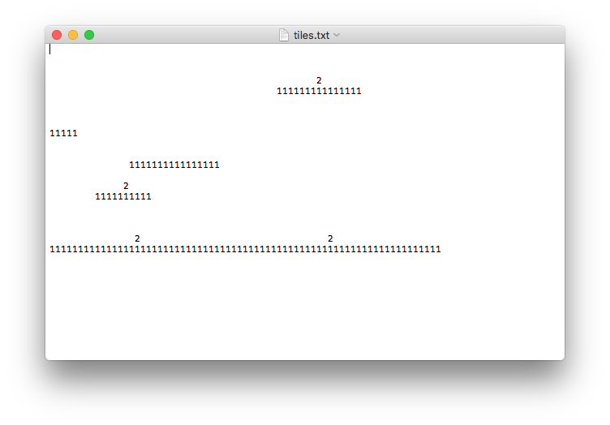

# Trin 4: ANIMATION

## Nye krav til programmet:

Jeres program skal nu udbygges med en animation, af minimum en karakter, f.eks. spilleren.   
I skal anvende spritesheet.   
Enten laver i det selv eller også downloader i et gratis fra nettet.

## Forslag til implementation:   

Her ser i mt spritesheet:

## Se følgende video, der viser hvordan mit program virker:

<iframe width="560" height="315" src="https://www.youtube.com/embed/X7_kU7p13ww" title="YouTube video player" frameborder="0" allow="accelerometer; autoplay; clipboard-write; encrypted-media; gyroscope; picture-in-picture; web-share" allowfullscreen></iframe>
