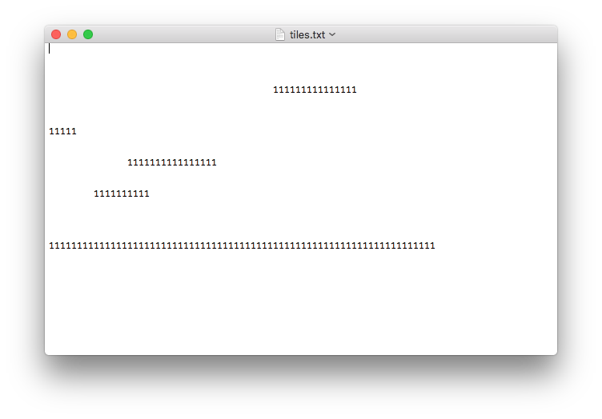

# Trin 3 : BYG COIN KLASSEN OG METODE DER LAVER COINS

Jeres program skal nu udbygges med følgende:

- Spilleren tjener point ved at opsamle coins  
- Der skal placeres et bestemt antal tilfældigt placerede coins   
- Hvis spilleren opsamler en coin skal der automatisk placeres en ny coin et tilfældigt sted på banen

I kan sandsynligvis genbruge meget kode fra tile-klassen...

## Vær opmærksom på:   

I skal muligvis omskrive dele af jeres kode for at få et simpelt og brugbart coin-system.   
Selv omskrev jeg tile-systemet, så hver tile ikke bare var en platform med forskellige længder, men istedet en rigtig tile med fastlåst længede og højde.
Så billede nedenfor:

Ved denne omskrivning var det nemmere at generere en tilfældig placerering af coins, ved ganske enkelt at vælge en tilfældig tile til hver coin!

## Se følgende video, hvor jeg viser mit coin-system:

<iframe width="560" height="315" src="https://www.youtube.com/embed/GSqC3OtCqWQ" title="YouTube video player" frameborder="0" allow="accelerometer; autoplay; clipboard-write; encrypted-media; gyroscope; picture-in-picture; web-share" allowfullscreen></iframe>
