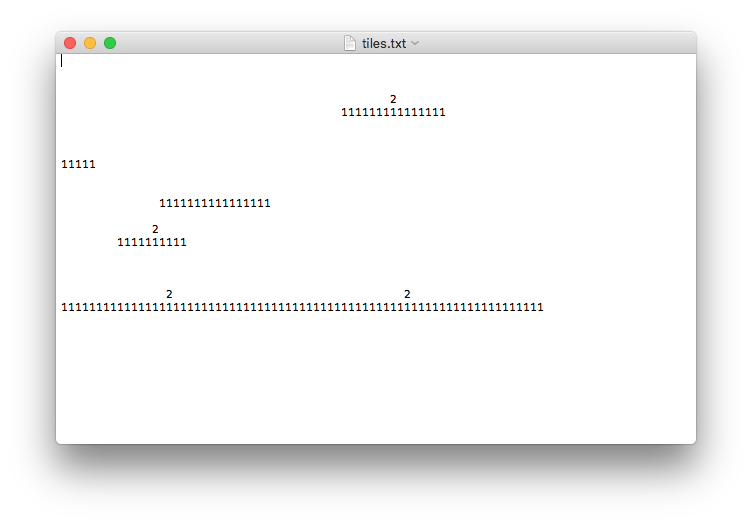

# Trin 4: LAV FJENDER

## Nye krav til programmet:

Jeres program skal nu udbygges med følgende:

- Der skal være fjender på banen 
- Fjenederne skal f.eks. placeres ud fra jeres tekst-fil, således at en bestemt karakter f.eks. 2 betyder fjener 
- Fjenderne skal kunne bevæge sig
- Hvis spilleren rammer fjenderne skal spilleren dø... 
- Man skal kunne genstarte spillet ved at trykke på en knap

I kan sandsynligvis genbruge meget kode fra tile-klassen eller coin-klassen...

## Hvordan loader man fjenerne fra tekst-filen:   
Se billede nedenfor, der viser min 'tiles.txt' som måske nu bare burde hedde 'map.txt' ??:

## Se følgende video, der viser hvordan mit program virker:

<iframe width="560" height="315" src="https://www.youtube.com/embed/X7_kU7p13ww" title="YouTube video player" frameborder="0" allow="accelerometer; autoplay; clipboard-write; encrypted-media; gyroscope; picture-in-picture; web-share" allowfullscreen></iframe>
