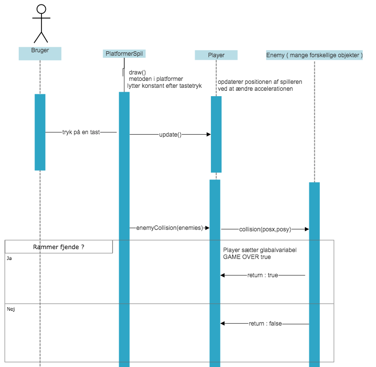
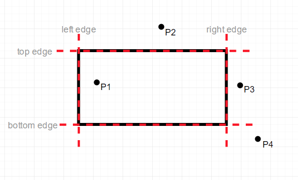

# Trin 6: Programmerings rapporten/synopsen 

Indholdet der beskrives her er det samme som i eksamensprojektet

## Hvad indeholder programmeringsrapporten/synopsen

Omfang 5 til 8 normalsiders tekst, eksklusiv billeder og bilag.

- **forside** : *relevant information vedrørende afleveringen*
- **kort abstract** : *så man kort kan orientere som om opgavens indhold*
- **problemformulering** : *kortfattet præcisering af problem der undersøges/løses*
- **kravspecifikation og designspecifikation** : *kravspec. er liste over funktionskrav, designspec. er visualisering design krav*
- **funktionsbeskrivelse** : *ikke-teknisk gennemgang af det endelige produkts skærmlayout og funktionalitet*
- **dokumentation af programmet** : *teknisk beskrivelse af programmet med dertilhørende diagrammer*
- **test af programmet** : *overholder programmet kravspec., eventuelt performance og/eller brugertest*
- **konklusion** : *udfordringer, potentielle forbedringer og/eller efterfølgender version*
- **bilag** : *programmets kode og andet relevant*

-----------------------------------------------------------------------------------------------------------------------------------------------------------

## Tekniske diagrammer 

Overordnet findes der to forskellige kategorier af diagrammer: **struktur-diagrammer** og **adfærds-diagrammer**.     
Man kan tegne diagrammerne i hånden, eller anvende et værktøj.   
Jeg har selv brugt: [https://www.smartdraw.com/](https://www.smartdraw.com/). Men desværre koster smartdraw penge!!

## Klassediagrammet for platformer-spillet 
Der skal være et klassediagram over hele programmet! Her er et bud på hvordan i kan tegne jeres klassediagram:

## Sekvens diagram
Som alternativ til flowcharts kan man anvende sekvens-diagrammer. Disse kan vise aktive objekter og dertilhørende funktions-kald.  
Nedenfor ses et eksempel på et sekvensdiagram over kollisioner med fjender.   
Se eventuelt følgende video for mere info: https://www.youtube.com/watch?v=pCK6prSq8aw.

## Alternative diagrammer og tegninger
Det kan være nødvendigt at tegne eller opfinde egne diagrammer for at illustrere en del af programmet. 
F.eks. ved kollisions-detektionen mellem firkanter og punkter, se her (kilde : https://happycoding.io/tutorials/processing/collision-detection):

## Pseudokode for platformer-spillet
I bør anvende pseudokode når i skal beskrive algoritmeagtige dele af jeres program.   
F.eks. kunne i anvende pseudokode til  *map-generering* : generering af banen. Hvordan bliver jeres teksfil fortolket og lavet om til tile-objekter eller lignende.

Nedenfor kan i se mit bud på en pseudokode, der beskriver map-genereringen:

´´´
indlæs linjer fra filen "tiles.txt"
    
    vælge første linje
       
       løkke-1: adder Y med 20 pixel
            Split linjen op i enkelte symboler
               
               vælg første symbol

               løkke-2: adder X med 20 pixel,   
                    hvis symbolet er "1" lav tile på plads (X,Y)
                    gentag "løkke-2" med næste symbol, hvis der er flere symboler/mellemrum
            
            gentag "løkke-1" med næste linje, hvis der er flere linjer ...

´´´

## Flowcharts for platformer-spillet ( måske næste gang ... )
