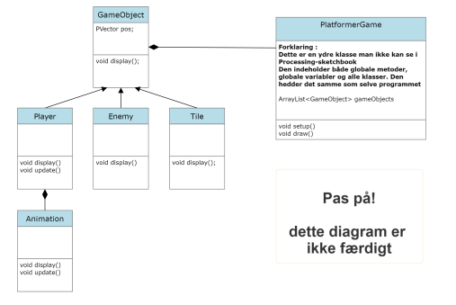

# Trin 6: Programmerings rapporten/synopsen 

Indholdet der beskrives her er det samme som i eksamensprojektet

## Hvad indeholder programmeringsrapporten/synopsen

Omfang 5 til 8 normalsiders tekst, eksklusiv billeder og bilag.

- forside : *relevant information vedrørende afleveringen*
- kort abstract : 'så man kort kan orientere som om opgavens indhold*
- problemformulering : *kortfattet præcisering af problem der undersøges/løses*
- kravspecifikation og designspecifikation : *kravspec. er liste over funktionskrav, designspec. er visualisering design krav*
- funktionsbeskrivelse : *ikke-teknisk gennemgang af det endelige produkts skærmlayout og funktionalitet*
- dokumentation af programmet : *teknisk beskrivelse af programmet med dertilhørende diagrammer*
- test af programmet : *overholder programmet kravspec., eventuelt performance og/eller brugertest*
- konklusion : *udfordringer, potentielle forbedringer og/eller efterfølgender version*
- bilag : *programmets kode og andet relevant*

## Tekniske diagrammer 

Det er meget vigtigt at få dokumenteret programmet vha. diagrammer. overordnet findes der to forskellige kategorier af programmer:
**struktur-diagrammer** og **adfærds-diagrammer**

Til at dokumentere platformerspillet skal i anvende følgende: klassediagram, aktivitets-diagram, flow-charts og pseudokode
Kan i gætte hvilke typer diagram klassediagram og flowcharts tilhører?

Man kan tegne diagrammerne i hånden, eller anvende et værktøj. Jeg har selv brugt: 
[www.smartdraw.com](www.smartdraw.com)

## Klassediagrammet for platformer-spillet 

Her er et bud på hvordan i kan tegne jeres klassediagram:

## Aktivitetsdiagram for platformer-spillet ( næste gang ... )

I bør have aktivitetsdiagrammer og/eller flowcharts for følgende dele af spillet

- *ovordnet spil-flow* : diagram over spillets flow og tilstande 
- *tile-kollision og tyngdekraft* : hvordan fungerer koden når man hopper og rammer en tile
- *animation* : hvordan 

## Pseudokode for platformer-spillet ( næste gang ...)

Man kunne anvende pseudokode til at beskrive indlæsningen af *map filen* og generering af banen