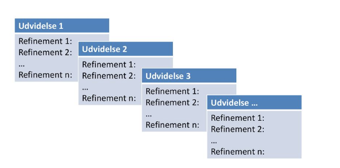

# Forløb 2 del 2 : Arbejdsmetode og billeder

------------------------------------------------

## Arbejdsmetoden

Når man laver computer programmer arbejder man ofte efter en metode man kan kalde ***stepwise improvement***



1. Man kan starte med at bryde sit problem eller opgave ned i del problemer, der hvis de laves en ad gangen efter hinanden vil resultere i det samlede
program
2. Herefter starte man på *første del*
3. Man tester løbende sin kode ved at køre programmet og eventuelt udskrive variabel værdier
4. Man går videre til næste del, når koden fungerer

------------------------------------------------

## Billeder 

Drag & drop billeder ind i din "kode editor", herefter kan du anvende billederne

```java
PImage p;
p = loadImage("bil.png");
image(p,1,1);

```
