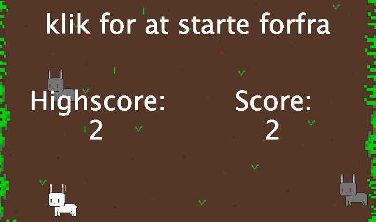

# DRY - En programmeringsmetode

Når man programmerer, er det afgørende, at koden er letlæselig, så den kan ændres og vedligeholdes med lethed. Hvis koden indeholder gentagelser, opstår der to problemer:

- Problem 1 : Det bliver mere besværligt at læse og forstå.
- Problem 2 : Ændringer skal foretages flere steder, hvis der opstår fejl.

Dette fører os til princippet ***D.R.Y: Don't Repeat Yourself.***

-----------------------------

## Opgaven 

Et  tidligere eksamensprojekt skal rettes, så det ikke indeholder uhensigtsmæssige gentagelser.

Eksamensprojektet skal rettes/refaktoreres således det ikke indeholder disse kodegentagelser. Men det er vigtigt ikke at skrive et helt nyt program fra bunden, der gør det samme med bedre kode! Dette er nemlig en øvelse i at forbedre kode ved at genkende "gentagelser" og udbedrer dem vha. nedarvning, poymorfi og introduktion af hjælper-funktioner.

Eksamensprojektet finder i her: [Eksamen_prog_final1.zip](Eksamen_prog_final1.zip)

- Start med at undersøge programmet og få en forståelse for koden. Fokuser især på, hvordan programmet registrerer fjendernes død, spillerens død og fjerner skud, der bevæger sig uden for skærmen.
- Der er gentagelser i koden i de forskellige klasser: Fjende, Skud og Spiller. Forsøg at forbedre dette ved at skabe en overordnet superklasse, GameObjekt.
- I fanen "Eksamen_prog_final1" er der betydelig gentagelse i logikken, der fjerner de objekter, der er blevet ødelagt. Fjern gentagelserne og udtræk dem til en separat metode.
- Både i Fjende-, Skud- og Spiller-klasserne er der gentagelse af kode, der markerer tilstanden "død". Fjern gentagelserne og isolér dem i en separat metode.
- Undersøg andre potentielle forbedringsmuligheder...

Denne opgave sigter mod at udvikle dine færdigheder i at genkende gentagelser i koden og finde måder at organisere og strukturere den på, så den bliver mere effektiv og vedligeholdelsesvenlig.

## Ekstra opgaver

- Når du analyserer programmets ydeevne, vil du bemærke, at udvikleren har organiseret spilobjekter i forskellige lister, såsom "fjendeskud", "fjender", "spillerskud" og selvfølgelig "spilleren". Dette organisatoriske valg påvirker naturligvis ydeevnen, men på hvilken måde?
Ved vurdering af ydeevnen fokuseres der typisk på løkker, især indlejrede løkker, da beregninger inden for disse løkker hurtigt kan medføre betydelig tidsforbrug. Forsøg at beregne/estimere, hvor mange gange der foretages kontrol af om objekter skal sættes i "død" tilstand,- altså som følge af skud eller kollisioner med andre objekter! (I din beregning skal du anvende seperate variable for størrelsen på de forskellige lister)
- Alternativt kunne en mere kompakt kodestruktur benyttes, hvor alle spilobjekter gemmes i én omfattende liste. Forsøg at beregne/estimere, hvor mange gange spilobjekter kontrolleres for "død" tilstand ved dette alternative design, hvor objekterne ramt af skud eller kollisioner med hinanden også tages i betragtning.
- Vis med et taleksempel, hvilken metode der er "hurtigst"...
- Forsøg at implementere en mekanisme for at begrænse antallet af skud for spilleren.
- Forsøg at implementere en "ammunitionskasse" mekanisme, som lejlighedsvis giver spilleren mulighed for at få ekstra skud.