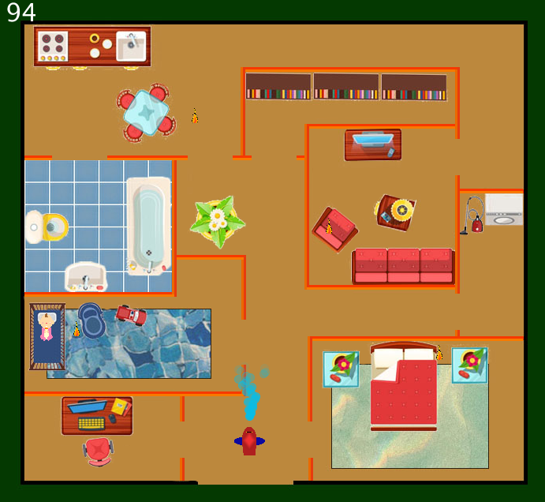

## Opgaven : refaktorering af brandmandsspillet

Ligesom i skydepillet skal du her prøve at identificere kodegentagelser og refaktorere vha. nye superklasser, nye funktioner og eventuelt andre ting..
Ret også funktionelle fejl.

[download brandmandsspillet her](eksamen_KLMVVBI.zip)

Hints:
- der kan forekomme tidspunkter hvor man skal lede efter hvor bestemte variabler eller funktioner er anvendt,- her kan man højre klikke og vælge "show usage"
- i dette projekt er der problemer med anvendelsen af klasser - kan i se hvad de gør forkert?
- nogle gange er det muligt at gå gennem en væg hvorfor!