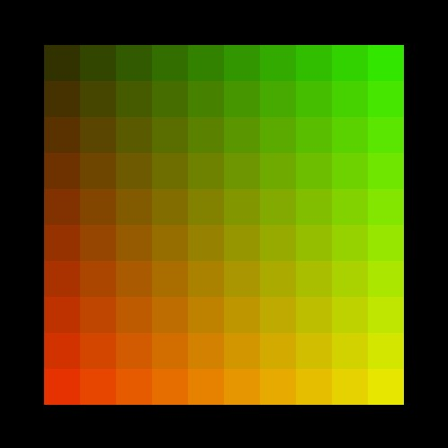

# Forløb 4
## Switch, while og for loops

[opsamling fra forløb 3](../forlob3_if_else_logiske_og_relations_operatorer/forlob3_opsamling.md)

## 1. del - oplæg om switch statement

referencen:   
[https://processing.org/reference/switch.html](https://processing.org/reference/switch.html)

slides til oplæg:    
[slides switch](slides_switch.pdf)

## 2. del - opgave i switch

I skal forsøge at lave et program, der gør det samme som det i ser på videoen.  
Det er dog et krav at i skal anvende et switch-statement til at skifte størrelsen på cirklen.   

Du kan anvende den indbyggede integer 'keyCode' til at tjekke den sidste anvendte tast's såkaldte key-code værdi.  
Den indbyggede char variabel 'key' indeholder tegnet/symbolet på tasten...se referencen her:
[https://processing.org/reference/keyCode.html](https://processing.org/reference/keyCode.html)    
[https://processing.org/reference/key.html](https://processing.org/reference/key.html)   

<iframe width="560" height="315" src="https://www.youtube.com/embed/nVqsBZzd22A?rel=0" title="YouTube video player" frameborder="0" allow="accelerometer; autoplay; clipboard-write; encrypted-media; gyroscope; picture-in-picture" allowfullscreen></iframe>

## 3. del - oplæg om iteration, for og while loops

referencen:   
[https://processing.org/reference/for.html](https://processing.org/reference/for.html)      
[https://processing.org/reference/while.html](https://processing.org/reference/while.html)     

slides til oplæg:
[slides loops](slides_switch.pdf)

### Træning i for-loops

Det traditionelle for-loop ser således ud, kan du sige hvad der sker i programmet?

```java
//hvad bliver skrevet ud og hvorfor
for(int i=0; i <10 ; i++){
  println(i);
}
```

Man kan sagtens udlade nogle af indgangene i for-loopet. Hvad betyder det for nedenstående program? 

```java
//hvad bliver skrevet ud og hvorfor
int i = 0;
for(; i < 10 ;){
  println(i);
  i++;
}
```
eller

```java
//hvad bliver skrevet ud og hvorfor
int i = 0;
for(; i < 10 ;){
  i++;
  println(i);
}
```
Man kan altid omskrive et for-loop til et while-loop og omvendt.     
Hvad sker der i nedenstående while-loop, og hvordan ville det tilsvarende for-loop se ud?

```java
int x = 0;
while(x<10){
  println(x);
  x++;
}
```

Her kommer der nogle "fejl" kan i se hvad fejlen er?

```java
//hvad bliver skrevet ud og hvorfor
int x = 0;
while(x<10);{
  println(x);
  x++;
}
```

```java
//hvad bliver skrevet ud og hvorfor
int x = 0;
for(int i=0; i<5;i++);{
  println(x);
  x++;
}
```


### Lav nedenstående opgaver både vha. while og for loops

- udskriv alle naturlige tal fra 1 til 20
- udskriv alle naturlige tal fra 20 til 1
- udskriv alle lige tal fra 1 til 20


## 4. del - opgave i loops

I kan denne gang vælge imellem tre forskellige sværhedsgrader i jeres afleveringsopgave.



<iframe width="560" height="315" src="https://www.youtube.com/embed/dT8u2Zgyhi8?rel=0" title="YouTube video player" frameborder="0" allow="accelerometer; autoplay; clipboard-write; encrypted-media; gyroscope; picture-in-picture" allowfullscreen></iframe>


<iframe width="560" height="315" src="https://www.youtube.com/embed/N929OS0dv14?rel=0" title="YouTube video player" frameborder="0" allow="accelerometer; autoplay; clipboard-write; encrypted-media; gyroscope; picture-in-picture" allowfullscreen></iframe>

