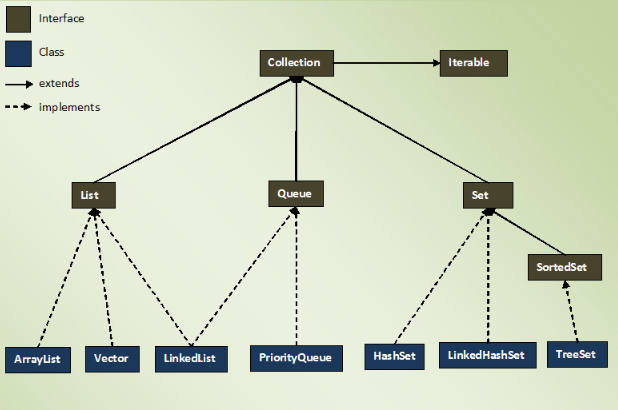
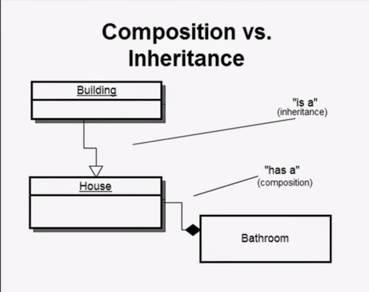

# Programmeringsprincipper og konventioner
Når man skriver funktionel kode, er to centrale mål:

- ***Læsbar kode:*** Koden bør være nem at forstå.
- ***Fleksibel kode:*** Koden bør være let at ændre.

Dette har ført til forskellige sprog, paradigmer og regelsæt. Dog er der ikke altid enighed blandt programmører om den bedste metode.

Inden for visse udviklingsmetoder er der dog bred enighed om visse regler og konventioner, der har vist sig at fungere godt.

-------------------------------------------------------------------------------------------------------------------------------

## Programmeringsprincipper

Inden for objektorienteret programmering er der mange designprincipper. Vi kigger her på to centrale designprincipper der stræber efter et smidigt og fleksibelt design:

### Princip 1 : program to an interface, not implementations: 
#### Skriv kode, der afhænger af abstraktioner (interfaces) snarere end specifikke implementeringer.

### Princip 2 : favor composition over inheritance:
#### Foretræk sammensætning af klasser vha. komposition istedet for at bruge arv.

-------------------------------------------------------------------------------------------------------------------------------

***Kode-eksempel på anvendelse af de to principper:***   
[eksempel : her er et eksempel på en "knap", der anvender begge ovenstående design-principper](kode_eksempel_oop_design.md)

***Blog, med et eksempel på komposition istedet for nedarvning:***     
[link: blog med et eksempel](https://dmitripavlutin.com/interface-vs-implementation/)     

***Diverse forskellige designprincipper:***     
[link: 10 oop-designprincipper](https://hackernoon.com/10-oop-design-principles-every-programmer-should-know-f187436caf65) 

-------------------------------------------------------------------------------------------------------------------------------

## Konventioner

Læsbar kode er afgørende. Indenfor "clean code" er der mange forksellige konventioner, der stræber imod mere læsbar kode. Her er to af de vigtigste:

- ***giv meningsfulde navne til variabler, funktioner, klasser og andre enheder i koden.***
- ***skab funktioner, der er små og udfører kun én opgave (og klasser, der har et enkelt "ansvar").***

[link: robert c. martin's bog 'clean code'](https://csiitian.blog/clean-code-by-robert-c-martin-book-summary-32690db5e75b)

--------------------------------------------------------

### Lav følgende opgave:

- Anvend dine ovenstående konventioner og principper til at forbedre en af de to eksamensprojekter fra sidst

- *Alternativ: Hvis du allerede er færdig med dette kan du ave et mini-projekt/program, hvor du anvender ovenstående konventioner og principper til at simulere et økosystem med forskellige væsner lavet som "autonome agenter" eller med "cellular automata".*  