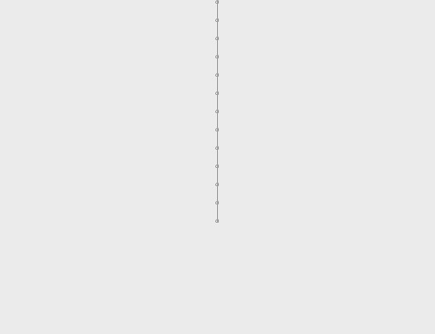
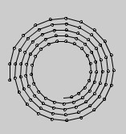
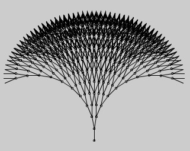

# Forløb 12
## Opgave : Tegning af træ med funktioner
### Emner : funktioner og rekursion

Nedenstående kode tegner en lille streg, med en circkel i begyndelsespunktet.   

Det er meningen at koden, der tegner den lille streg skal anvendes til at tegne et helt træ!

```java
void setup(){

  size(500,500);

  //Kode der tegner en illustration af en gren
  float v =PI/4;
  float l =20;
  float x1=50;
  float y1=50;
  float x2=cos(v)*l+x1;
  float y2=sin(v)*l+y1;
  ellipse(x1,y1,3,3);
  line(x1,y1,x2,y2);

}
```
### Opgaver

1. Gennemgå koden og forstå hvordan den virker, hvad gør de forskellige variabler?

2. Flyt koden for "grenen" ud i en funktion, med input parametre til start-punkt, længde og vinkel...     
Afprøv metoden - virker den?
```java
//sådan skal funktions signaturen se ud
void gren(float l, float v, float x1, float y1){
  //funktions-kode
}
```

3. Kan du få funktionen "gren" til at kalde sig selv - så den efter hver tegnet gren tegner en ny gren i forlængelse...Din kode fejler sikkert! Prøv at regn ud hvorfor??    


4. Prøv at indtænk en begrænsning på antallet af grene "gren" skal tegne...
Du kan f.eks. lave en parameter der bestemmer antallet:
```java
//Måske således?
void gren(float l, float v, float x1, float y1,int N){
  //funktions-kode
  gren(float l, float v, float x2, float y2,int N-1)
}
```

5. Prøv at se om du kan tegne følgende mønster:       



6. Se om du kan få "grenen" til at tegne to nye grene i enden af hver gren i stedet for kun én! Så det ser nogenlunde såldes ud:        

